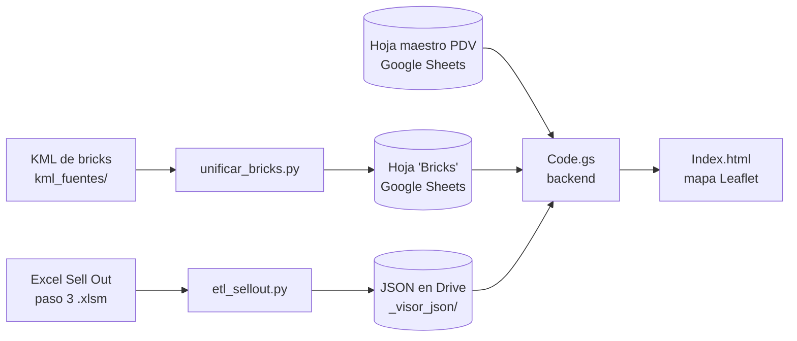

# Mapa de Cobertura Estratégica — ISDIN Colombia

Herramienta de GIS + BI que muestra la cobertura comercial de ISDIN en Colombia (Bogotá, Medellín, Cali y Cartagena). Cruza tres fuentes: **bricks** (zonas geográficas), el **maestro de puntos de venta (PDV)** y los **datos de Sell Out**. Con eso colorea cada zona según su rendimiento (semáforo), analiza la distribución de cada producto y detecta brechas de oportunidad.

El repositorio tiene **tres piezas** que trabajan en cadena:

| Pieza | Tecnología | Qué hace |
| --- | --- | --- |
| **1. Bricks** (`unificar_bricks.py`, `asignar_bricks.py`) | Python + geopandas | Unifica los KML de zonas de 4 ciudades en una sola capa estándar y asigna brick a PDV por coordenadas. |
| **2. ETL de Sell Out** (`etl_sellout.py`) | Python | Lee el Excel consolidado de Sell Out, lo agrega por PDV, BU, SKU y mes, y deja JSON compactos en Google Drive. |
| **3. Visor web** (`Apps Script/`) | Google Apps Script + Leaflet | Mapa interactivo que lee la hoja de Google Sheets (bricks y PDV) y los JSON del ETL. |



---

## Estructura del repositorio

```
Mapa_Colombia/
├── README.md                     # Este archivo
├── CLAUDE.md                     # Guía técnica de la parte de bricks (esquemas de los KML)
├── PLAN_VISOR_PDV.md             # Plan original del visor de PDV
│
├── etl_sellout.py                # 2. ETL de Sell Out (Excel → JSON)
├── config.example.py             #    Plantilla de configuración del ETL (copiar a config.py)
├── requirements.txt              #    Dependencias del ETL (openpyxl, python-calamine)
│
├── unificar_bricks.py            # 1. Unifica los KML → Colombia_Bricks.kml / .xlsx / .geojson
├── asignar_bricks.py             #    Asigna brick a PDV por coordenadas (punto en polígono)
├── brick_ids.csv                 #    Registro permanente de códigos brick_id (no editar a mano)
├── kml_fuentes/                  #    KML originales por ciudad
├── Brick_*.kml                   #    KML originales (Bogotá, Medellín, Cali, Cartagena)
├── Localidad_Bogota.kml          #    Localidades de Bogotá (capa de referencia)
├── Colombia_Bricks.*             #    Capa unificada de 162 bricks (kml, xlsx, geojson)
├── pull.py                       #    Descarga auxiliar de la hoja maestro de PDV
│
├── .clasp.json                   # Configuración de clasp (rootDir = "Apps Script")
└── Apps Script/                  # 3. Visor web (proyecto de Google Apps Script)
    ├── Code.js                   #    Backend — en el editor de Apps Script se ve como "Code.gs"
    ├── Index.html                #    Frontend (Leaflet + KPIs + paneles)
    ├── Menú Principal.js         #    Menú "🛠️ Herramientas Datos" en la hoja
    ├── Módulo Geocodificación.js #    Geocodificación, códigos postales, asignación de bricks
    ├── Módulo Cruce de Datos.js  #    Reconciliación CRM ↔ Sell Out
    ├── Módulo Centros Médicos.js #    Centros médicos cercanos (Places API)
    ├── appsscript.json           #    Manifest del proyecto de Apps Script
    └── CLAUDE.md                 #    Guía técnica del visor y sus módulos
```

> **Nombres `.js` y `.gs`:** clasp descarga los archivos de Apps Script con extensión `.js`. `Apps Script/Code.js` en el repo es el mismo archivo que aparece como `Code.gs` en el editor web.

**No se suben al repositorio** (ver `.gitignore`): `config.py` (rutas locales), los entornos virtuales (`venv/`, `.venv/`), los Excel de datos (`*.xlsx`, `*.xlsm`, salvo `Colombia_Bricks.xlsx`), la salida del ETL (`so_*.json`, `salida/`) y los archivos de credenciales.

---

## 1. Bricks (zonas geográficas)

`unificar_bricks.py` homologa los 4 KML (cada uno con un esquema distinto) a un estándar único: `brick_id`, `nombre`, `zona`, `ciudad`, `departamento`, `nombre_brick`. Genera juntos `Colombia_Bricks.kml`, `.xlsx` y `.geojson` con **162 bricks**.

- **`brick_id`:** código corto y estable de hasta 10 caracteres (`BOG-001`, `MED-001`, `CAL-001`, `CTG-001`), pensado para el campo de brick del CRM. `brick_ids.csv` guarda la memoria de los códigos. Un código asignado nunca cambia ni se reutiliza.
- **Jerarquía:** departamento > ciudad > zona > brick. En Bogotá la zona es la localidad; en el resto de ciudades, zona = ciudad.
- **Formato del Excel:** la hoja *Bricks* incluye centroide, bounding box y geometría GeoJSON, para poder etiquetar PDV desde Apps Script sin archivos externos.

```bash
python unificar_bricks.py                        # regenera Colombia_Bricks.*
python asignar_bricks.py "<xlsx, csv o URL de Google Sheets>"   # asigna brick a PDV
```

Requiere geopandas (ver `CLAUDE.md` para el detalle de cada KML).

---

## 2. ETL de Sell Out (`etl_sellout.py`)

Lee en streaming el Excel consolidado del **paso 3 del Sell Out** (`3. Affiliate_Master so 2026.xlsm`, hoja `Final`), agrega las ventas y escribe en Drive los JSON que consume el visor. Procesa unas 570 mil filas en unos 35 segundos.

### Instalación

```powershell
python -m venv venv
venv\Scripts\python.exe -m pip install -r requirements.txt
copy config.example.py config.py      # y ajustar RUTA_EXCEL y CARPETA_SALIDA
```

Usa **python-calamine** para leer el Excel (rápido). Si no está instalado, cae a **openpyxl** en modo solo lectura.

### Uso

```powershell
venv\Scripts\python.exe etl_sellout.py --inspect        # revisa hojas, encabezados, mapeo, filtros y 3 filas
venv\Scripts\python.exe etl_sellout.py --limite 5000    # prueba con las primeras 5000 filas
venv\Scripts\python.exe etl_sellout.py                  # corrida completa
```

Corre siempre `--inspect` primero cuando cambie la estructura del Excel. Muestra qué columna quedó asignada a cada campo y cómo se normalizan las primeras filas.

Después de cada corrida, ejecuta `limpiarCache()` en el editor de Apps Script para que el visor lea los JSON nuevos.

### Configuración (`config.py`)

| Variable | Para qué sirve |
| --- | --- |
| `RUTA_EXCEL` | Ruta al `.xlsm` del paso 3. |
| `CARPETA_SALIDA` | Carpeta de Drive (`_visor_json`) donde se escriben los JSON. |
| `NOMBRE_HOJA` / `FILA_ENCABEZADOS` | Hoja con los datos (`"Final"`) y fila de encabezados. |
| `COLUMNAS` | Para cada campo (`fecha`, `pos_id`, `pdv_desc`, `bu`, `sku`, `prod_desc`, `familia`, `units`, `amount`), lista de fragmentos que se buscan en los encabezados. Primero se buscan coincidencias exactas y luego parciales. Los fragmentos de 3 letras o menos solo cuentan como palabra completa. |
| `OBLIGATORIOS` | Campos sin los cuales la fila se descarta (`fecha`, `pos_id`, `amount`). |
| `FILTROS` | Solo pasan las filas con esos valores. Hoy: `Affiliate = Colombia`, porque la hoja también trae Panamá, en USD. |
| `DIMENSION_PRODUCTOS` | Cruza el EAN con la hoja `DIM Productos` para completar la **BU** (`SUB FAMILIA`: DERMA, FOTO, ISDINCEUTICS, PLAT. WATER, OTRO). Solo rellena campos que la venta trae vacíos. |
| `N_FRAGMENTOS` / `N_FRAGMENTOS_SKU` | En cuántos archivos se reparten el detalle por PDV (16) y el índice por producto (8). |

### Normalización

- **Fechas:** acepta `datetime`, serial de Excel, `d/m/aaaa` y `aaaa-mm-dd`. Se agregan por mes (`AAAA-MM`).
- **Números:** acepta coma decimal y separadores de miles (`1.234.567,89`, `1,234,567.89`, `12,5`).
- **POS_ID:** en mayúsculas, sin espacios y con `:` convertido a `_` (`111:S566` → `111_S566`). El SKU/EAN solo pasa a mayúsculas y se le quitan los espacios.

### Archivos que genera

Todas las series usan **tripletas compactas** `[índiceMes, unidades, importe]`. `índiceMes` es la posición del mes en la lista `meses` del archivo.

| Archivo | Contenido | Lo usa el visor para |
| --- | --- | --- |
| `so_pdv.json` | `{meses, pdv: {POS_ID: {desc, bu: {BU: serie}}}}` — PDV × BU × mes | Base del mapa, semáforo y KPIs |
| `so_portafolio.json` | `{meses, sku: {SKU: {desc, familia, bu, serie}}}` — SKU × mes | Selector de producto y panel de portafolio |
| `so_indice.json` | `{n_fragmentos, pdv: {POS_ID: {desc, frag, unidades, importe}}}` | Saber en qué `so_detalle_NN` está cada PDV |
| `so_detalle_NN.json` (16) | `{fragmento, meses, pdv: {POS_ID: {SKU: serie}}}` — PDV × SKU × mes | Portafolio de un PDV o de un brick (bajo demanda) |
| `so_sku_indice.json` | `{fragmentos, meses, sku: {SKU: fragmento}}` | Saber en qué `so_sku_NN` está cada producto |
| `so_sku_NN.json` (8) | `{SKU: {POS_ID: serie}}` — índice invertido SKU × PDV × mes | Análisis de producto: dónde rota cada SKU |
| `so_manifiesto.json` | Fecha de corrida, mapeo de columnas, filtros, filas leídas o descartadas, SKU sin cruce, totales por mes | Diagnóstico y auditoría |

Cada PDV (o SKU) cae siempre en el mismo fragmento, calculado con un hash CRC32 estable. Así el visor descarga solo el archivo que necesita. Los JSON se escriben de forma atómica (`.tmp` + reemplazo) para que Drive nunca sincronice un archivo a medias. El manifiesto se escribe de último.

---

## 3. Visor web (`Apps Script/`)

Un único proyecto de Apps Script (gestionado con [`clasp`](https://github.com/google/clasp)) con **dos superficies** que comparten la misma hoja de cálculo:

1. **Mapa interactivo:** `Code.gs` (backend) + `Index.html` (frontend con [Leaflet](https://leafletjs.com/)). Muestra los bricks coloreados por un semáforo de Sell Out y los PDV como marcadores con KPIs.
2. **Herramientas de datos:** `Menú Principal.js` agrega el menú `🛠️ Herramientas Datos` a la hoja. Desde ahí se geocodifica, se limpian datos y se cruza el CRM con el Sell Out.

### Contrato de datos

| Fuente | Contenido | Columnas / claves |
| --- | --- | --- |
| Hoja `Bricks` | Polígonos de zona (desde `Colombia_Bricks.xlsx`) | `brick_id`, `geometria_geojson`, `nombre_brick`, `ciudad`, `zona` |
| Hoja `CO_Puntos_Maestro clientes` | Maestro de PDV | `Latitud`, `Longitud`, `Nº Oficina Farmacia` (= `POS_ID`), `Potencial Cliente`, `Channel`, `Grupo de compras` |
| Carpeta `_visor_json` en Drive | Salida del ETL | Archivos `so_*.json` (ver tabla anterior) |

El cruce PDV ↔ ventas se hace por `POS_ID` = `Nº Oficina Farmacia`, con la misma normalización que usa el ETL.

### Qué muestra

- **Período:** todos los meses, últimos 3 o 6, año actual o selección personalizada mes a mes.
- **Semáforo por brick:** cuartiles del Sell Out de los bricks con venta. Rojo = cuartil inferior, luego naranja y amarillo, y verde = cuartil superior. Gris = sin ventas en el período. También se puede colorear por ciudad.
- **Filtros de PDV:** grupo de compras, canal, región, población y potencial. Los gráficos de canal, grupo y región también funcionan como filtros al hacer clic.
- **KPIs generales:** PDV con Sell Out, Sell Out del período, promedio mensual y unidades.
- **Paneles:** Top 10 PDV y portafolio Top 12 productos. Al hacer clic en un PDV o en un brick se abre su portafolio.
- **Diagnóstico:** botón que muestra los archivos de Drive, el manifiesto del ETL y el porcentaje de PDV que cruzan con ventas.

### Despliegue

```bash
clasp login          # una sola vez, con la cuenta dueña del script
clasp pull           # trae la versión del editor (sobrescribe lo local)
clasp push           # sube Apps Script/ al proyecto (rootDir definido en .clasp.json)
clasp open           # abre el editor
clasp deployments    # lista los despliegues de la web app
```

La API key de Google Maps (`GOOGLE_MAPS_API_KEY`) vive en **Script Properties**, nunca en el código.

---

## Análisis estratégico de SKU (para gerentes de marca)

El visor responde las preguntas que un **gerente de marca** o de BU se hace sobre cada producto: *¿dónde rota?, ¿dónde falta?, ¿a qué precio sale? y ¿dónde está la oportunidad?*

### Cómo usarlo

1. En **Análisis de producto**, elige la **unidad de negocio** (BU) y luego el **producto (SKU)**. El selector ordena los productos de mayor a menor Sell Out del período.
2. El mapa **se recolorea con las ventas de ese producto**. Cada brick toma el color del cuartil de venta del SKU, y en gris quedan las zonas donde no se vende.
3. Combina con el **período** y los **filtros de PDV** (canal, grupo, región, potencial) para comparar segmentos.

### Indicadores del producto

| KPI | Cálculo | Lectura estratégica |
| --- | --- | --- |
| **Sell Out del producto** | Importe del SKU en los PDV visibles y el período | Peso del producto en la selección |
| **Cobertura** (distribución numérica) | PDV que venden el SKU ÷ PDV visibles | Qué tan presente está. Baja cobertura con alta rotación = oportunidad de distribución |
| **Rotación** | Unidades ÷ PDV que lo venden ÷ meses | Velocidad de venta por punto. Mide la salida real, independiente de cuántos PDV lo tienen |
| **Precio promedio** | Importe ÷ unidades (ponderado por volumen) | Posicionamiento de precio y detección de descuentos por canal o grupo |
| **Unidades** | Suma de unidades del período | Volumen físico para planear abastecimiento |

### Paneles de análisis

- **Tendencia mensual:** importe y unidades del SKU mes a mes. Sirve para ver estacionalidad (por ejemplo, fotoprotección), curvas de lanzamiento y el efecto de las campañas.
- **Top 10 PDV del producto:** dónde se concentra la venta, para cuidar los puntos clave.
- **Brechas de oportunidad:** PDV de **alto Sell Out total que NO venden este producto**. Es la lista priorizada para la fuerza de ventas: puntos que ya compran ISDIN y donde falta el SKU.
- **Portafolio por PDV o por brick:** qué productos se venden en un punto o una zona, para detectar huecos de surtido frente al portafolio de la marca.

### Preguntas típicas que resuelve

- ¿En qué zonas de Bogotá rota más un lanzamiento, y dónde todavía no llegó?
- ¿Qué cadenas o canales tienen el precio promedio más bajo del SKU?
- ¿Qué PDV de potencial alto no tienen el producto líder de la BU?
- ¿La cobertura crece mes a mes después de una activación?

---

## Correcciones recientes del visor

| Problema en producción | Causa | Corrección |
| --- | --- | --- |
| `Error: No encontré 'so_detalle_[object Object].json'` al abrir el portafolio de un PDV o brick | `so_indice.json` guarda cada PDV como objeto `{desc, frag, …}` y `Code.gs` usaba el objeto completo como número de fragmento | `fragDePdv_()` lee `.frag`, se aplica `parseInt(…, 10)` antes de cada `nombreFrag_()`, y `nombreFrag_()` valida y lanza un error claro si recibe `NaN` |
| Portafolio de PDV o brick vacío (0 productos) | `so_detalle_NN.json` guarda los PDV dentro de la clave `pdv` y `Code.gs` los buscaba en la raíz del archivo | `pdvsDeFragmento_()` lee `datos.pdv` (y sigue aceptando el formato plano) |
| Selector de SKU sin productos y "Portafolio · Top 12: Sin datos" | `recPort()` esperaba `{productos: {d, bu, s}}` y el ETL entrega `{sku: {desc, bu, serie}}`. Además, si el portafolio llegaba antes que el Sell Out, se ordenaba con el período vacío | `recPort()` normaliza el formato del ETL; `dibujarPort()` espera `listo.ventas` y `listo.port`; `llenarSku()` usa `sumarSerieTotal()` como respaldo y se reordena cuando llegan las ventas; la BU se compara con `.trim().toUpperCase()`; el selector vuelve a la opción vacía si el SKU previo ya no existe |

---

## Estado actual

- **Bricks:** 162 bricks unificados de Bogotá, Medellín, Cali y Cartagena, con códigos estables.
- **ETL de Sell Out:** en producción, con filtro Colombia, BU desde `DIM Productos`, detalle por PDV e índice invertido por producto.
- **Visor:** mapa con semáforo por cuartiles, filtros de PDV, portafolio por PDV o brick y análisis estratégico de SKU (cobertura, rotación, precio promedio, tendencia y brechas).
- **Calidad de datos pendiente:**
  - Cerca del 1,4 % del importe de Colombia (tiendas y canal digital) llega sin `POS_ID` y el ETL lo descarta.
  - 4 EAN no están en `DIM Productos` y quedan como `SIN_BU`.

## Próximos pasos

1. **Tienda perfecta:** medir el rendimiento de cada PDV y brick no solo por Sell Out, sino por la ejecución en el punto de venta:
   - **Disponibilidad de producto (agotados):** porcentaje de SKU del portafolio obligatorio presentes en el anaquel.
   - **Espacios lineales:** participación de ISDIN en el lineal frente a lo acordado.
   - **Visibilidad permanente:** exhibidores y material fijo instalados.
   - **Visibilidad de campaña:** implementación del material de las campañas vigentes.
2. **PDV Pareto:** colorear en el mapa los PDV del Pareto (los que concentran la mayor parte del Sell Out), para priorizar la atención de los puntos críticos.
3. **Cobertura de visitas:** distinguir en el mapa los PDV **visitados**, los **asignados y no visitados** y los **no asignados** a ningún delegado, para detectar huecos de cobertura de la fuerza de ventas.
4. **Fase 2:** scoring de brechas de oportunidad por cohorte, prescripciones médicas de la competencia e índice de precios competitivos basado en los productos de mayor rotación.

---

## Autor

Sebastián González — Trade Marketing / Analítica Comercial, ISDIN Colombia.
